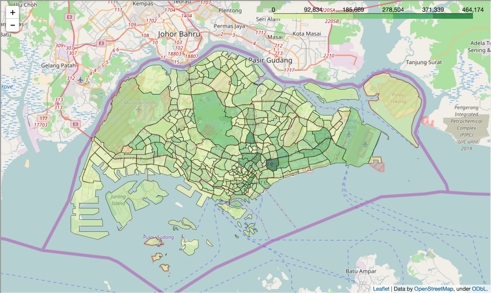

# Example using DataSpark's DAAS(data-as-a-service) API

Query the DAAS API to get footfall counts in the various ROIs(region of interests), and visualize using a choropleth plot.

Change your input parameters as necessary:
```
#### Input parameters #####################################
consumerKey = "<YOUR-CONSUMER-KEY>"
consumerSecret = "<YOUR-CONSUMER-SECRET>"
startDate = '2017-01-11'
startTime = '00:00:00'
endDate = '2017-01-11'
endTime = '23:59:59'
interval = 'day'
###########################################################
```

